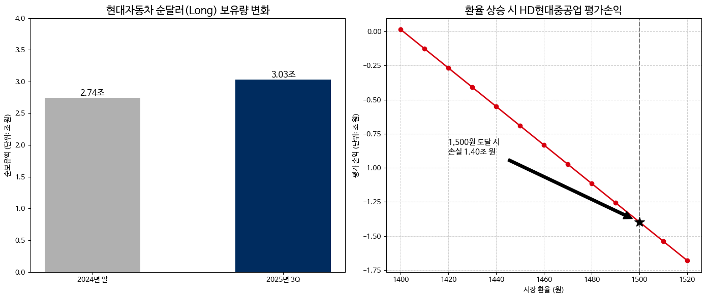

<div align="center">

# 💸 고환율(1,460원~) 고착화에 따른<br>수출 대기업 FX 리스크 시뮬레이션 (2025.3Q)

> **정부의 외환 시장 개입 명분과 기업별 대응 전략(Long vs Hedge) 데이터 검증**

  

</div>

---

## 1. 📝 프로젝트 개요 (Overview)

2025년 원/달러 환율이 **1,460원대**에 고착화됨에 따라, 정부의 외환 시장 안정화 대책과 기업의 자금 운용 전략이 충돌하고 있습니다.
본 프로젝트는 국내 대표 수출 기업인 **현대자동차**와 **HD현대중공업**의 재무제표 주석(Footnote)을 분석하여, 거시경제 변수(환율)가 개별 기업에 미치는 **재무적 파급력(Impact)**을 정량적으로 시뮬레이션하였습니다.

* **🎯 분석 대상:** 현대자동차(Long Position) vs HD현대중공업(Short Position)
* **📅 분석 기간:** 2024년 사업보고서 ~ 2025년 3분기 (누적)
* **🔑 핵심 지표:** 순외화 노출 포지션(Net FX Exposure), 파생상품 평가손익(Valuation G/L)

<br>

## 2. ⚙️ 분석 방법 (Methodology) : Hybrid Data Engineering

데이터의 **정합성(Accuracy)**과 분석의 깊이를 확보하기 위해 **정밀 수기 검증과 파이썬 시뮬레이션을 결합한 하이브리드 방식**을 채택했습니다.

### ⓵ Manual Data Extraction (Cross-Check)
* **한계 극복:** DART API로는 추출이 불가능한 재무제표 **주석(Notes)** 내의 비정형 데이터(민감도 분석 표, 파생상품 체결 내역)를 직접 추출했습니다.
* **데이터 검증:** 2024년 사업보고서와 2025년 3분기 보고서를 대조하여 데이터 오류 가능성을 원천 차단했습니다.

### ⓶ Python Reverse Engineering (Simulation)
* **역산 로직(Reverse Calculation):** 공시된 '환율 5% 변동 시 손익' 데이터를 역산하여, 비공개된 **순외화 보유 잔액(Net Exposure)**을 추정했습니다.
* **BEP 도출:** 파생상품 평가손실과 계약 규모를 기반으로 **평균 약정 환율(Break-even Point)**을 산출하여 위기 시나리오(Stress Test)를 수행했습니다.

<br>

---

## 3. 📊 주요 분석 결과 (Key Findings)

데이터 분석 결과, 두 회사는 환율 변동에 대해 정반대의 포지션을 취하고 있으며, 이에 따른 리스크 유형도 명확히 갈렸습니다.

### 📈 1. 현대자동차 (Long Position: 달러 보유 확대)
> **"정부 압박의 타겟이 되다"**

* **변화:** 2024년 말 (2.74조 원) → **2025년 3Q (3.03조 원)**
* **💡 Insight:**
    > 고환율 기조에도 불구하고 순달러 보유량을 약 **3,000억 원** 더 늘렸습니다. 이는 환차익을 극대화하려는 전략이지만, **"외화 유동성을 공급하라"는 정부 정책 기조와 대치**되는 지점으로, 향후 환전 압박의 1순위 타겟이 될 가능성을 시사합니다.

### 📉 2. HD현대중공업 (Risk Simulation: 1,500원 위기설)
> **"1,500원은 생존의 마지노선"**

* **추정 약정 환율(BEP):** **약 1,401원**
* **💡 Insight:**
    > 구조적으로 선물환 매도(Hedge) 포지션을 취하고 있어 환율 상승 시 장부상 손실이 불가피합니다. 시뮬레이션 결과, 환율이 심리적 마지노선인 **1,500원**을 돌파할 경우 **약 1.4조 원의 평가 손실**이 발생하여 부채비율 급등 리스크가 현실화됨을 입증했습니다.

<br>

---

## 4. 🖼️ 결과 시각화 (Result)

아래 그래프는 Python(Matplotlib)을 이용해 시뮬레이션한 결과입니다.


*(좌: 현대차의 순외화 보유량 증가 추이 / 우: 환율 상승에 따른 HD현대중공업 손실 급증 시뮬레이션)*

<br>

## 5. 🛠 사용 기술 (Tech Stack)

| Category | Tech | Description |
| :--- | :--- | :--- |
| **Language** |  | Python 3.10+ |
| **Data Source** | **DART** | 금융감독원 전자공시시스템 (주석 데이터) |
| **Libraries** | `Pandas` | 데이터 프레임 구성 및 수치 연산 |
| | `Matplotlib` | 시나리오별 스트레스 테스트 시각화 (한글 폰트 적용) |

<br>

## 6. 📂 프로젝트 구조 (File Structure)

```bash
FX-Risk-Simulation/
├── FX_Risk_Simulation.py     # 🐍 데이터 역산 로직 및 시각화 메인 코드
├── README.md                 # 📄 프로젝트 명세서
├── requirements.txt          # 📦 필요 라이브러리 목록
├── results/                  # 📊 분석 결과 그래프 (이미지 저장소)
└── assets/                   # 📑 근거 자료 (DART 주석 캡처 원본)
