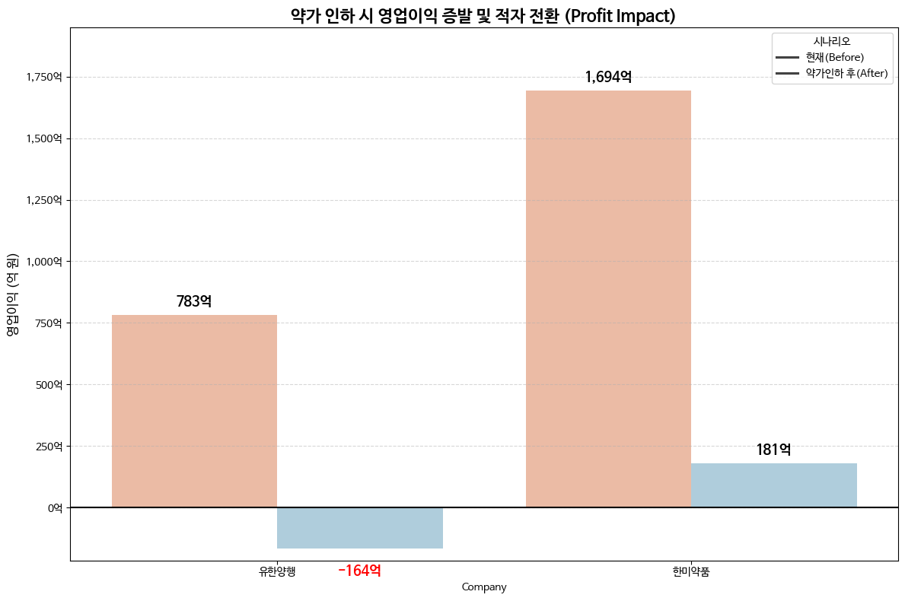
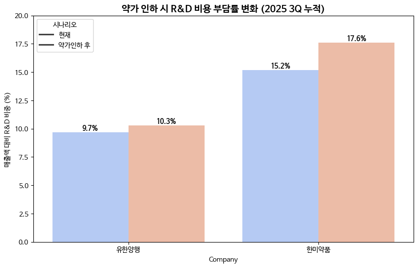

# 💊 정부 약가 인하 정책 시뮬레이터 (Pharma Policy Impact Simulator)

## 1. 프로젝트 개요 (Project Overview)
정부의 **'약가 제도 개선안(복제약 가격 인하)'**이 국내 주요 제약사의 재무 건전성에 미치는 영향을 정량적으로 분석한 **스트레스 테스트(Stress Test) 모델**입니다.

단순한 과거 데이터 조회가 아닌, **DART Open API**를 활용하여 **2025년 3분기 최신 누적 실적**을 실시간으로 수집하고, 재무제표 주석(Footnote)을 심층 분석하여 기업별 리스크 노출도(Risk Exposure)를 정교하게 산출했습니다.

## 2. 핵심 목표 (Key Objectives)
1.  **데이터 자동화 (Automated Data Collection):** DART API를 활용해 2025년 3분기 누적 재무 데이터 자동 추출 파이프라인 구축.
2.  **데이터 교차 검증 (Hybrid Analysis):** API로 확인이 어려운 '제품/상품 매출 비중' 및 '내수 비중'은 사업보고서 주석을 분석하여 반영, 데이터 정합성 확보.
3.  **재무 리스크 진단 (Financial Stress Test):** 약가 15% 일괄 인하 시나리오 적용 시, **영업이익 증발(Profit Erosion)** 및 **적자 전환(Turn to Red)** 가능성 진단.

## 3. 사용 기술 (Tech Stack)
-   **Language:** Python 3.x
-   **Data Collection:** `dart-fss` (Open DART API Wrapper)
-   **Data Analysis:** `pandas` (데이터 전처리 및 연산)
-   **Visualization:** `matplotlib`, `seaborn` (시나리오별 손익 변화 시각화)

## 4. 분석 로직 및 방법론 (Methodology)
본 프로젝트는 **'내수 시장'**에서 판매되는 **'자체 생산 제품(제네릭 포함)'**만이 약가 인하의 직접적 타깃이 된다는 점에 착안하여 아래와 같은 로직을 수립했습니다.

### 4-1. 데이터 수집 구조
* **정량 데이터 (API):** 매출액, 영업이익 (2025년 3Q 누적 실적)
* **정성 데이터 (Manual):**
    * 제품(Product) vs 상품(Merchandise) 비중
    * 내수(Domestic) vs 수출(Export) 비중
    * R&D 비용 규모 및 비중

### 4-2. 스트레스 테스트 산출 공식
$$\text{매출 감소분(Loss)} = \text{총 매출} \times \text{제품 비중} \times \text{내수 비중} \times \text{약가 인하율(15\%)}$$

$$\text{조정 영업이익} = \text{기존 영업이익} - \text{매출 감소분}$$

## 5. 주요 분석 결과 (Key Findings)
*2025년 3분기 누적 실적 기준 분석*

### 🚨 1. 유한양행 (Yuhan Corp.) : 적자 전환 위험 (Risk of Deficit)
* **Data Fact:** 통념과 달리 2025년 3분기 기준 **제품 매출 비중(48.5%)**이 상품 매출을 상회함을 주석 분석을 통해 발견했습니다.
* **Simulation Result:** 기술료 수익 감소로 영업이익률(OPM)이 4.8%로 낮아진 상황에서 약가 인하 충격(-947억 원) 발생 시, **영업이익 적자 전환(-164억 원)** 위험이 포착되었습니다.

### 📉 2. 한미약품 (Hanmi Pharm.) : 이익 급감 (Profit Erosion)
* **Data Fact:** 자체 제품 비중이 **97.8%**에 달해 규제 민감도가 극도로 높은 사업 구조입니다.
* **Simulation Result:** 약가 인하 시 매출 감소분이 **기존 영업이익의 약 90%를 잠식**하며, 이에 따라 **R&D 비용 부담률이 15.2% → 17.6%로 급증**하여 미래 성장 동력이 저하될 우려가 있습니다.

## 6. 시각화 결과 (Visualizations)



*Figure 1. 약가 인하 시나리오별 영업이익 변화 (유한양행 적자전환 위험)*


*Figure 2. 매출 감소에 따른 R&D 비용 부담률 증가*

## 7. 실행 방법 (How to Run)

### 사전 준비 (Prerequisites)
* Python 3.8 이상 환경
* DART API Key 발급 ([Open DART 포털](https://opendart.fss.or.kr/))

### 설치 및 실행
```bash
# 필수 라이브러리 설치
pip install dart-fss pandas matplotlib seaborn
